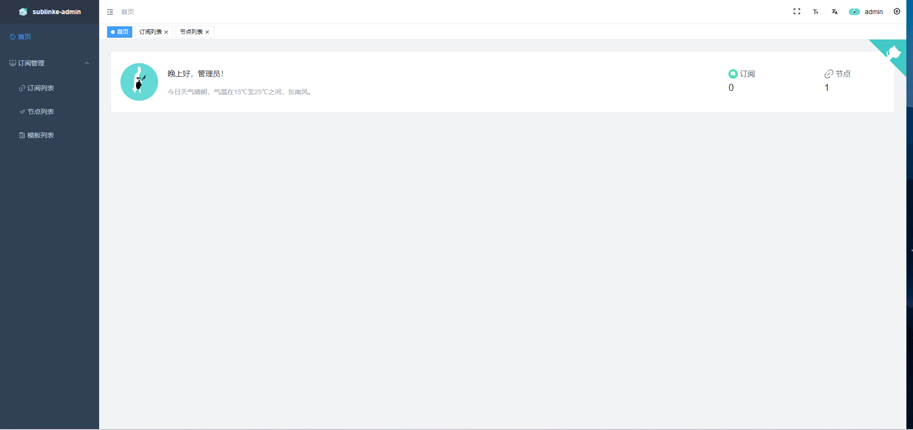
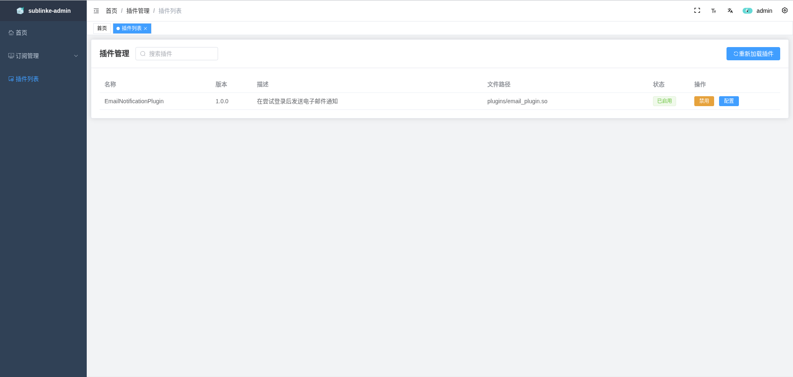

<div align="center">

</div>

<div align="center">
  
  
  
  
  <div align="center"> <a href="README.md">中文</a> | English</div>


</div>

# Project Introduction

`sublinkE` is an open-source node subscription conversion and generation management system based on secondary development of [sublinkX](https://github.com/gooaclok819/sublinkX).

- Frontend based on [vue3-element-admin](https://github.com/youlaitech/vue3-element-admin);
- Backend using Go + Gin + Gorm;
- Default account: admin Password: 123456, please make sure to change it after installation;

# Modifications


- [x] Fix some page bugs
- [x] Support Clash `dialer-proxy` attribute
- [x] Allow adding and using API KEY to access API
- [x] Import and schedule updates of nodes from subscription links
- [x] Support AnyTLS and Socks5 protocols
- [x] Subscription node sorting
- [x] Support plugin extensions (experimental)
- [ ] ...

# Project Features

- High flexibility and security, supporting subscription record access and simple configuration management;
- Support for multiple client protocols and formats, including:
    - v2ray (base64 universal format)
    - clash (support ss, ssr, trojan, vmess, vless, hy, hy2, tuic, AnyTLS, Socks5)
    - surge (support ss, trojan, vmess, hy2, tuic)
- Added token authorization and subscription import functionality, enhancing security and convenience.

# Installation Instructions
```bash
docker run --name sublinke -p 8000:8000 \
-v $PWD/db:/app/db \
-v $PWD/template:/app/template \
-v $PWD/logs:/app/logs \
-v $PWD/plugins:/app/plugins \
-d eun1e/sublinke 
```

# Plugin Description

`sublinkE` provides a flexible plugin system, allowing developers to extend system functionality without modifying core code.

## Plugin Development Guide

### Basic Steps

1. **Create Plugin File**: Refer to `plugins_examples/email_plugin.go` to write custom plugins
2. **Compile Plugin**: Use `plugins_examples/build_plugin.sh email_plugin.go` to compile into a `.so` file
3. **Deploy Plugin**: Place the compiled `.so` file into the `plugins` directory

### Plugin Interface Implementation

All plugins must implement the `plugins.Plugin` interface, which includes the following core methods:

```go
// Required methods
Name() string                           // Plugin name
Version() string                        // Plugin version
Description() string                    // Plugin description
DefaultConfig() map[string]interface{}  // Default configuration
SetConfig(map[string]interface{})       // Set configuration
Init() error                            // Initialize
Close() error                           // Cleanup

// Event handling method (API event listening)
OnAPIEvent(ctx *gin.Context, event plugins.EventType, path string, 
           statusCode int, requestBody interface{}, 
           responseBody interface{}) error

// Declare API paths and event types the plugin is interested in
InterestedAPIs() []string
InterestedEvents() []plugins.EventType
```

### Plugin Examples

The system includes the following example plugins for reference:

| Plugin Name | Description | Source Code | Compiled Version |
|-------------|-------------|------------|-----------------|
| **Email Notification Plugin** | Monitors login events and sends email notifications | [email_plugin.go](https://github.com/eun1e/sublinkE/blob/main/plugins_examples/email_plugin.go) | [Download .so file](https://raw.githubusercontent.com/eun1e/sublinkE/main/plugins_examples/email_plugin.so) |

### Plugin Configuration and Management

Plugins can be managed through the Web interface:
- Enable/disable plugins
- Configure plugin parameters
- View plugin status

## Developing Custom Plugins

Custom plugin development workflow:

1. Create a Go plugin file, implementing the `plugins.Plugin` interface
2. Export the `GetPlugin()` function, returning the plugin instance
3. Define API paths and event types the plugin is concerned with
4. Implement event handling logic
5. Use the build script to compile the plugin

```bash
# Compile plugin
wget https://raw.githubusercontent.com/eun1e/sublinkE/main/plugins_examples/build_plugin.sh
chmod +x build_plugin.sh
./build_plugin.sh your_plugin.go
# Copy the generated .so file to the plugins directory
cp your_plugin.so ../plugins/
```

For more advanced features and detailed API documentation, please refer to the code examples.

# Project Preview





